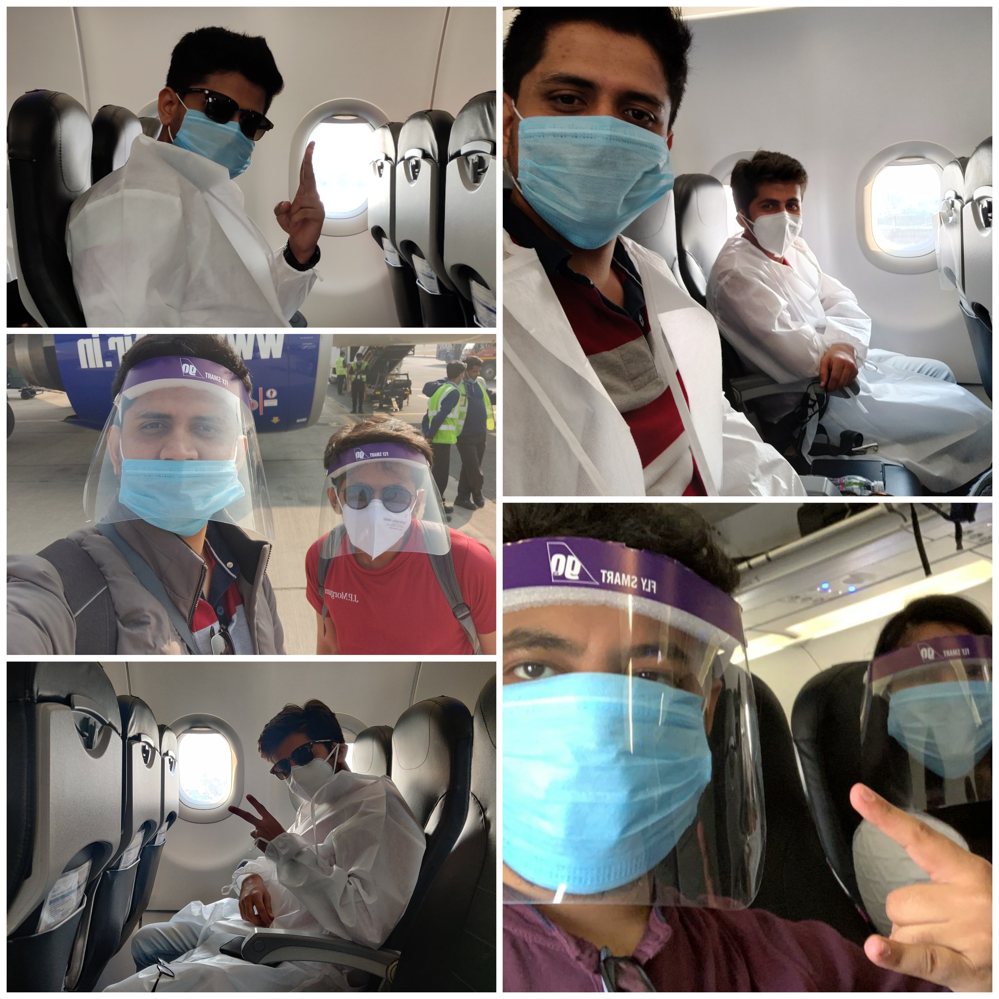
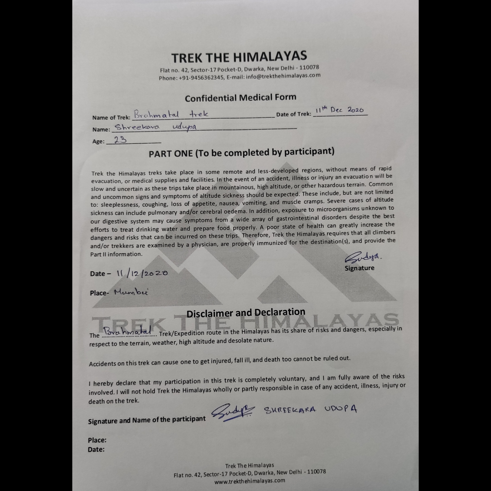
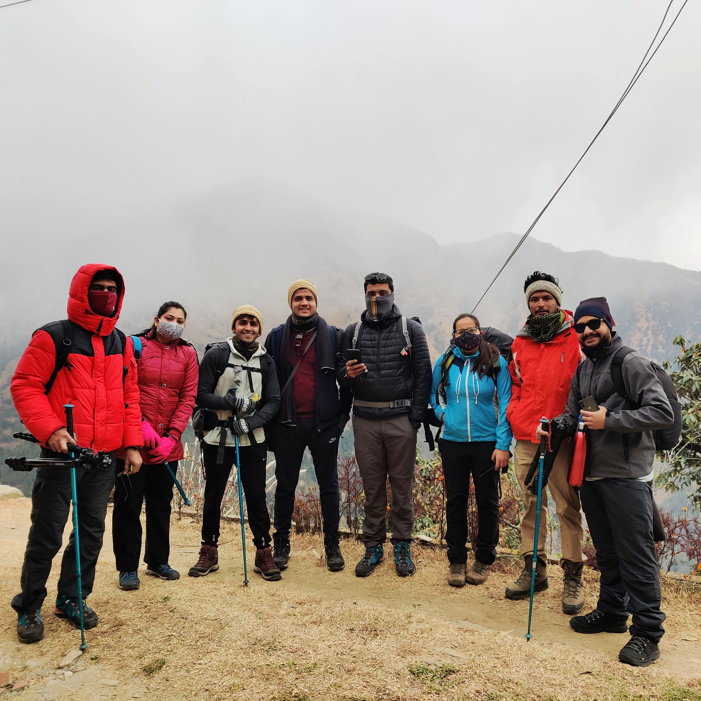

This being my debut blog, brace yourself for a long journey to 12,000 ft above sea level. I assure you your safety. *(The Burj Khalifa is only 2,000 ft high.)*

## Preparation

The day was 24th October 2020, when a group was created by one of my friends who had decided to do a trek in the Himalayas way back in January, when we were unaware of how 2020 was going to be. Initially there were 4 people in the group but after people joining in and dropping out, the final count was 6. Little did we know that stress, chaos and adventure had joined our group too.

Even after knowing the great lockdown, inter-state travelling restrictions and non-functional public transport, our unfit, adventurous and optimistic group went ahead and booked the trek with "Trek the Himalayas." After a lot of Google searches and a hell lot of YouTube videos, I realised I need to get fit first, and started my cycling and running. I was not even close to the expected stamina for the trek, but the workout helped me keep my muscles loose.

So the final plan was devised: Flight to Delhi, by road to Lohajung base camp, Trek, by road Munsiyari, by road Mukteshwar, back to Delhi. We were travelling more than 1,300 km by road and we didn't think twice, because we knew how heavenly the destination was going to be.

This was also the time when the Farmers' Bills were passed and the protests around Delhi had started. Along with this stress, we had to carry a Covid-negative report, as the Uttarakhand government had mandated the negative report and e-pass to cross the border. 48 hours before the trip, everyone scheduled an RT-PCR test. That was one of the most stressful moments of the trip: even one positive would lead to cancellation of the whole trip, plus 10 days quarantine. We needed 6 negative results, and we also asked the driver to test. An added pressure indeed.

## 10th December 2020

It was a happy day. Our over-optimistic plan was working. We had the required documents, all negative reports, e-pass for Uttarakhand, loads of courage and positivity.

Travelling to the Himalayas in December 2020, pandemic and all.

We were 6 of us but had booked a 12-seater tempo traveller, knowing the amount of time we were going to spend on roads, and also because we got an amazing driver.

Two days before the flight, we got a call from GoAir that the flight was cancelled and we had to take an early morning flight. Plans change every moment during a pandemic, rules change every day and nothing is sure until the last moment. So we landed in Delhi 5 hours early, and being an optimistic group, we took those 5 hours to "acclimatize."

Our driver did face some issues entering Delhi due to the farmers' protest but he somehow made it. We finally left for our first stop: Khurpatal.

## Khurpatal

We reached there at 11 PM, checked in, had dinner, and when I looked up at the sky it was clear and filled with stars. Two photographer friends, @shagunbathija and Kaustubh Nerurkar, started shooting the sky, which looked absolutely amazing. This was the first time I had witnessed such a clear sky with thousands of stars.

Lunch stop at Khurpatal.

## 11th December, The Road to Lohajung

Early morning we woke up for our first sunrise in the Himalayas. Temperature was around 12-15 degrees, a perfect hill station morning. Everyone got ready, did some photoshoot, and we checked out.

Destination for the day: Lohajung base camp. We left around 10 AM, covering more than 200 km. Maps estimated 8 hours. It took us almost 11.

The road to Lohajung is not straightforward. It's a remote village, the road is not well developed, and the last 50-60 km we had no network and had to rely on offline maps through dense forest in the dark. Roads were really bad. It was tiring, but the landscapes of the Himalayas and a beautiful sunset kept us going.

We reached Trek the Himalayas base camp around 8 PM. The trek leader was there to welcome us and also sanitize us. Temperature around 5 degrees, and I was already in 4 layers and freezing.

We got our rooms, really basic, just 4 walls and a mattress. We later realised that a bed and washroom at that altitude is an absolute luxury. We were welcomed with spring rolls and hot chai, followed by dinner. Post dinner, we got a brief summary of the plan for the next 3 days, completed all formalities, submitted the required forms and reports, and went to sleep.

*(We had to fill a declaration form and get one filled by a physician declaring us fit for the trek. Read the disclaimer carefully. It's scary.)*

  
  

Lohajung basecamp &nbsp;·&nbsp; The declaration form that made us question our life choices.

## 12th December, Trek Day 1

We woke up between the great Himalayas to a heavenly sunrise. It was really cold and that was the best view I had from my bed. We hadn't seen the location since we'd arrived in the dark, and when we saw it in the morning, we were stunned. I felt that the bad roads and no network are all for the good. They maintain the sanity and beauty of this place.

We spent almost 2 hours doing a photoshoot when we should have been warming up for the trek. We rented Poncho, Gaiters, Trekking Pole and Trekking Fleece from the local store and packed our offloading bags, the bags carried to the next base camp by mules, so you can trek without carrying the heavy load.

  
  

The view from our room at Lohajung. This is why it is the most beautiful base camp.

While we were having breakfast, we could sense the weather changing. Temperature dipping, snow clouds moving towards us. It was the first snowfall of the winter, and our excitement had no limit. All our prayers had clearly worked.

Six warriors and 2 trek leaders: nervous and unaware of what was coming, but ready for the adventure. 100 metres into the trail and the snowfall started. That was the first time I experienced snowfall. Everyone was screaming like babies. I didn't plan my packing properly and had offloaded my poncho. Good learning.

Mountains in the background, snow clouds rolling in. It was about to get real.

We started with a brown trail and in 15-20 minutes it had turned white. The transition was unreal and the snowfall was peaceful. I put my music on and just enjoyed each step. I looked at my friend and we both had that relief in our eyes. All the efforts, the planning, the stress, everything felt less in front of this beauty.

Brown trail to white trail in 20 minutes.

First day was 6-7 hours of trekking. We were full of energy though our clothes were getting wet, some body parts already frozen, and the snowfall increasing continuously. Trek leaders were a little tense. If the snowfall continued till the next day, Brahmatal lake would be covered and the summit couldn't be done. They were thinking through every permutation and combination of alternate trails.

  
[ Pahadi dogs on the trail ]

  
[ Hydration break ]

Pahadi dogs on the trail, and a hydration break that became a photoshoot.

We climbed the last mountain and could see the campsite beside a frozen lake. That was really satisfying. Between some random forest in the Himalayas, a frozen lake, 4 tents, one kitchen tent, and complete silence.

## Bekaltal Campsite at 9,690 ft

[ Campsite 1 at Bekaltal ]

Campsite 1 at Bekaltal, 9,690 ft. Tent check-in: complete.

We did our cooldown session and then came a small lecture on AMS (Acute Mountain Sickness). Trust me, after the lecture you will feel like you have all the symptoms and should return to base camp. But hold on. Sit, let it sink in, because this is what you came for.

Post the lecture we had snacks and chai, then walked 500 metres to Bekal Tal lake for sunset.

[ Bekal Tal Lake ]

Bekal Tal, no less than a scene from Game of Thrones.

This lake was the best scene of Day 1. Temperature below zero, slight winds, standing beside the frozen lake listening to stories about it. The trek leaders were sharing experiences about Roopkund trek, a similar lake filled with skeletons of extraordinary sizes, which don't look like normal human skeletons.

Walking back to camp in the dark, we passed a small shop beside the campsite, a permanent shop run by a girl and her younger brother. Their customers were trekkers like us. Their parents work in the base camp, and these two run a shop at 9,700 ft without basic amenities. At that point I realised how blessed we are and how small our problems are. We voluntarily put ourselves in these harsh conditions for fun, and in a couple of days we'll be back to urban life with all the luxuries, while they work high in the mountains to make their daily living.

Post dinner: oxymeter check. At sea level a reading of 95+ is normal. At altitude, the air is thin, so 80 is normal. Everyone read between 85 and 92. And then my turn: 78. The trek leader looked concerned. Asked me to drink more water and keep them informed if I had breathing problems.

Fireside chats, then tents. Tents on snow, temperature in minus, tired, slightly feverish, and that oxymeter reading haunting me. Thoughts of going back from the first campsite crossed my mind. Somehow, the night passed.

## 13th December, Trek Day 2

Woke up at 6 AM after 2-3 hours of proper sleep. The sky was clear, the best news possible. First experience of dry toilets: not bad, but we had bigger problems because everything was frozen. Packing the sleeping bag and clearing the tent was a big task when your hands aren't moving and you're shivering. We got our gaiters and mini spikes for snow and were ready for Day 2.

Another 6-7 hours of trekking. 2 hours to Jhandi Top, the first point where we could see Mount Trishul very closely, then 3-4 hours to Brahmatal Lake.

Once we reached Jhandi Top, my body was giving up slightly. The sun was out, I was in one layer, but I felt cold. Fatigue from no sleep, breathing issues, stamina issues on the ascent. I somehow kept going and reached the lunch point, and my body severely needed rest.

  
"Trekking is a bit like life. The journey only requires you to put one foot in front of the other, again and again and again. And if you allow yourself the opportunity to be present throughout the entirety of the trek, you will witness beauty every step of the way, not just at the summit."

I covered my face with my cap and rested. The best power nap I've ever had. Sun out after almost two days, temperature pleasant. After the nap: Snickers, protein bars, dry fruits. Lunch done.

[ Power nap location ]

My happy place. The best power nap of my life at this exact spot.

I put my music on and grasped it all in. This was a moment of gratitude. I was just thankful I could witness this. We should be thankful for what we have; we will end up having more. If you concentrate on what you don't have, you will never have enough.

## Campsite 2, 10,450 ft

We could see the summit peak from our campsite. No shop here like the previous one, which meant no fire for rescue. We requested a bonfire but forest authorities don't allow it. No option but to bear the cold.

The campsite was set up below the summit mountain, 500 metres from Brahmatal Lake. Open area, strong winds, temperature around -5°C and predicted to drop to -10°C overnight. Getting out of the tent to reach the kitchen area was already difficult. Socks wet from snow, shoes frozen. I couldn't feel my feet for two straight days.

[ Campsite 2 ]

Campsite 2 at 10,450 ft. We could see the summit from here.

The food from Trek the Himalayas was amazing: soup, Maggi, chai, and at the second campsite, Jalebi. Everyone shivering in the dining area, eating Jalebi at 10,450 ft. That's a memory.

The sky was clear. It was the Geminids meteor shower night. Temperature dipping further due to cold winds, reaching -10°C. Everyone had the same question: how will we survive this night? We'd planned this trek partly for the meteor shower, which would peak around 3 AM.

Finished dinner by 8 PM and went to camps to sleep early. My camp mate was feeling a little feverish. I too wasn't sure what my body was going through. We decided to wake up at 2:30 AM.

## 2:30 AM, The Geminids

[ Geminids meteor shower ]

Geminids meteor shower captured by @Kaustubh, Brahmatal Lake.

At 2:30 AM I somehow gathered the motivation and energy to come out of the warm sleeping bag and step into the wind. It was majestic outside, millions of stars, and every 5 to 10 seconds a shooting star.

We had got everything we asked for and were more than content. All the hard work, stress, planning, and efforts were worth it at that moment.

I had to walk 500 metres from the campsite and stand still for 15 seconds for the DSLR to capture it. I could see footprints of some animal and it was pin-drop silence. The photographers kept their cameras out of the tent and we went back to sleep for 3-4 hours.

## 14th December, Summit Day

Again woke up at 6 AM. The original plan was to summit in the morning and halt at another campsite before base camp. Then one brilliant mind in our group pointed out: the last campsite is only 2 hours from base camp. Why not skip it and go directly to base camp after summiting? We confirmed this with the trek leaders. They warned us it would be a long day, but it could be done.

9 AM, we packed our bags, visited Brahmatal lake, and started the Summit Day trek. We could see the summit from camp, and it seemed to rise higher as we got closer to it. After almost 2 hours of ascent we reached the summit at 12,000 ft.

[ Summit at 12,000 ft ]

Brahmatal Trek Summit at 12,000 ft. The highest altitude I had been to.

Mount Trishul and Nandagunti, up close. It was magnificent. The highest altitude I had been to, and a genuinely proud moment. At that moment everything was calm and stable, and it brought calmness and satisfaction in myself.

Oh, how can I put into words the scenes that delight the eyes, the blessed peace of mind, the sheer exuberance which fills your soul. As we were a small batch and the first batch after lockdown, there was absolutely no one else out there. The silent forest, the calmness of mountains, the exhilaration of the summit, something that will stay with us forever.

The plan was to spend 15 minutes on the summit and then leave. We spent more than 1 hour clicking pictures and creating memories. We still didn't want to leave.

  
[ Summit group photo ]

  
[ Mount Trishul view ]

Group photos at the summit. Mount Trishul on the right.

I sat there for around 10 minutes and grasped all that was possible. Thanked god for creating this, and for being able to witness it. It was not an easy journey, and that is the only reason it was extra special.

## The Descent

Around 1 PM we started the descent. The previous trails were all covered with snow so we had to mark our own trail. First stop: Jhandi Top. Then the campsite we were supposed to stay at, but skipped, and straight to base camp. We reached base camp around 6:30 PM, dark by then, but we had spent some extra time watching the sunset on the way down.

[ Sunset during descent ]

The last sunset at Lohajung, marking the end of the Brahmatal Trek.

The last sunset at Lohajung marked the end of our Himalayan journey.

Me and my friend couldn't believe it had ended and that we had to go back to civilisation. Due to all the stress before the trek and the freezing nights in tents, we had questioned ourselves why we came. All our friends questioned why put so much effort, who tires themselves out on a vacation? But at that moment we had answers to all those questions.

[ Felicitation ceremony ]

First Himalayan summit. 4 day trek in 3.

The happiness on our face explains everything. Very proud that we summited our first Himalayan trek without any complications. We completed a 4-day trek in 3 days.

## What It Taught Me

We are voluntarily putting ourselves in harsh conditions for fun, and in a couple of days we're back to urban life with all the luxuries, while the people who live on those mountains work there to make their daily living. That alone is worth an hour of quiet reflection.

If you allow yourself to be present throughout a trek, not just at the summit, you witness beauty every step of the way. The trail demands nothing clever. It just asks you to keep moving. One foot, then the other. That's the whole instruction.

That, and go in December, when the world is covered in snow, and the meteor showers are free.

  <iframe src="https://www.youtube.com/embed/LNBvrHTKZCg" title="First Himalayan Trek, Brahmatal Uttarakhand | December 2020" allow="accelerometer; autoplay; clipboard-write; encrypted-media; gyroscope; picture-in-picture" allowfullscreen></iframe>

First Himalayan Trek, Brahmatal Uttarakhand | December 2020

  <iframe src="https://www.youtube.com/embed/XPN4n4KwsS0" allow="accelerometer; autoplay; clipboard-write; encrypted-media; gyroscope; picture-in-picture" allowfullscreen></iframe>

---

*Trek company: Trek the Himalayas · Trek leaders: Meenakshi Bhist & Aditya Thakur*
*Photography: @shagunbathija, Kaustubh Nerurkar*
